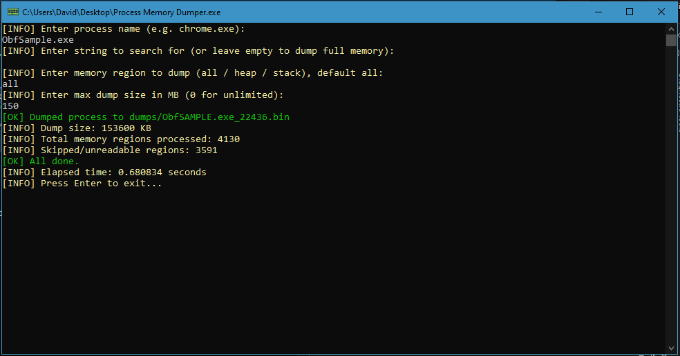

# Memory Dumper

**Memory Dumper** is a C++ application designed to extract memory from running processes on Windows systems. It supports filtering memory regions, optional string searching, and multithreaded processing for efficiency.

## Features

- **Process Selection:** Automatically enumerates all running processes and filters by executable name (e.g. `chrome.exe`).
- **Memory Dumping:** Dumps readable, committed memory regions (`PAGE_READWRITE`, `PAGE_READONLY`, etc.) of the selected process.
- **Region Filtering:** Supports three types of memory regions:
  - `all` – dumps all eligible memory regions.
  - `heap` – dumps regions of type `MEM_PRIVATE`.
  - `stack` – dumps memory regions typically used for stacks (`MEM_PRIVATE` + `PAGE_GUARD` or `PAGE_READWRITE`).
- **Max Size Limit:** Allows setting a maximum dump size (in MB) to avoid large outputs.
- **Multithreading:** Dumps multiple matching processes concurrently using threads.
- **String Search:** If a search string is provided, it scans the memory dump and extracts unique null-terminated matches containing the string.
- **Output:** Dumps are saved as binary files in the `dumps/` directory, named using the process name and PID.
- **Logging:** Includes colored status messages for info, success, and errors (optional for CLI readability).

## How It Works

1. Captures a snapshot of all running processes using `CreateToolhelp32Snapshot`.
2. Compares each process name (case-insensitive) against the user-provided target.
3. For each match:
   - Opens the process with `PROCESS_VM_READ` and `PROCESS_QUERY_INFORMATION`.
   - Iterates through memory using `VirtualQueryEx`, filtering by region type and protection flags.
   - Reads memory using `ReadProcessMemory`, within the specified size limit.
   - Optionally searches the dump for user-defined string values.
   - Saves the binary output to the `dumps/` folder.

  

## Requirements

- Windows operating system
- C++17 compatible compiler
- Windows SDK headers/libraries (e.g. `Windows.h`, `TlHelp32.h`)

## Note

This tool is intended for forensic analysis, research, and educational purposes. Do not use it on unauthorized systems.
